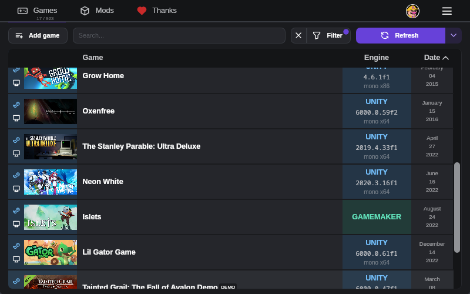

# Rai Pal

[](https://raicuparta.com)



## Install

### Windows

Download the installer:

[](https://github.com/Raicuparta/rai-pal/releases/latest/download/RaiPal.exe)

or install via winget:

```
winget install Raicuparta.RaiPal
```

### Linux

Download the AppImage:

[](https://github.com/Raicuparta/rai-pal/releases/latest/download/RaiPal.AppImage)

## What's this?

A tool that helps you use and make universal game mods. That means mods that aren't made for any specific game, but work across multiple games, usually of the same game engine. Popular examples are [UEVR](https://github.com/praydog/uevr) and [UUVR](https://github.com/raicuparta/uuvr). Some features:

- Auto-find installed games from supported providers.
- Auto-find owned (but not necessarily installed) games from supported providers.
- Detect relevant information about each game, such as their game engine and engine version.
- Easily install/run the correct version of universal mods.
- Easily update universal mods.

## Automatically finding games

Rai Pal analyzes files on your system to determine which games you own, and which games you have currently installed. There's some guesswork involved in this, especially since Rai Pal tries to give you this information as quickly as possible, without the need to log in with each provider's account. Here is how Rai Pal handles finding games from each provider:

| Provider | Installed games | Owned games | Notes                                                                                                                                                                                                                                                                   |
| -------- | --------------- | ----------- | ----------------------------------------------------------------------------------------------------------------------------------------------------------------------------------------------------------------------------------------------------------------------- |
| Steam    | ✅              | ✅\*        | Also detects non-Steam games added to the Steam library.                                                                                                                                                                                                                |
| GOG      | ✅              | ✅          |                                                                                                                                                                                                                                                                         |
| Epic     | ✅              | ✅          |                                                                                                                                                                                                                                                                         |
| Itch     | ✅              | ✅\*        | Does not include games from bundles, unless you add them to your library. There are [scripts](https://gist.github.com/lats/c920866caf9c0cb04e82abba411e1bb9) for adding all games from a bundle to your library, but they're slow and not recommended by the Itch team. |
| PC Xbox  | ✅\*            | ❌          | Only finds installed games marked as moddable (the ones where you can open the game files folder via the Xbox app)                                                                                                                                                      |

For all other providers, you'll have to manually add the games to Rai Pal using the "add game" button on the installed games tab, or by just dropping the game exe on the Rai Pal window.

## Game engine detection

Rai Pal also uses a few different methods for detecting game engines. There's a lot of guesswork here as well. For installed games this is usually pretty straightforward, but for owned games it involves using remote sources, and often going by the game's name. Here is how Rai Pal handles detecting the game engine from each provider:

| Provider | Engine<br>(installed games) | Engine version<br>(installed games) | Engine<br>(owned games) | Engine version<br>(owned games) |
| -------- | --------------------------- | ----------------------------------- | ----------------------- | ------------------------------- |
| Steam    | ✅                          | ✅                                  | ⭐ Great guess          | 👍 Good guess                   |
| GOG      | ✅                          | ✅                                  | 👍 Good guess           | 👍 Good guess                   |
| Epic     | ✅                          | ✅                                  | 🤏 Decent guess         | 🤏 Decent guess                 |
| Itch     | ✅                          | ✅                                  | 🤏 Decent guess         | 🤏 Decent guess                 |
| PC Xbox  | ✅                          | Unity only                          | 👎 Not available        | 👎 Not available                |

## License

    Rai Pal
    Copyright (C) 2024  Raicuparta

    This program is free software: you can redistribute it and/or modify
    it under the terms of the GNU General Public License as published by
    the Free Software Foundation, either version 3 of the License, or
    (at your option) any later version.

    This program is distributed in the hope that it will be useful,
    but WITHOUT ANY WARRANTY; without even the implied warranty of
    MERCHANTABILITY or FITNESS FOR A PARTICULAR PURPOSE.  See the
    GNU General Public License for more details.

    You should have received a copy of the GNU General Public License
    along with this program.  If not, see <https://www.gnu.org/licenses/>.
